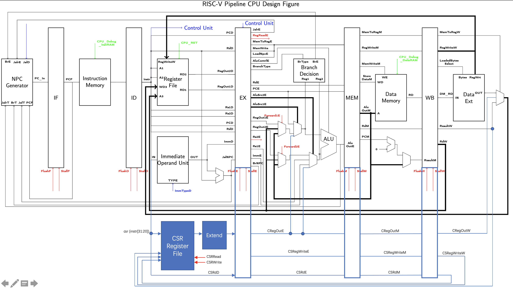

1. 描述执行一条 XOR 指令的过程（数据通路、控制信号等）。 

   假设没有出现Forward、Hazard。

   数据通路：

   ```mermaid
   graph LR
   id1(instr)
   
   id1--A1-->id14(Register)--RD1/RegOut1D/1E-->id6(Forward1Mux)-->id8(ALUSrc1Mux)-->id10
   id1--A2-->id15(Register)--RD2/RegOut2D/2E-->id7(Forward2Mux)-->id9(ALUSrc2Mux)-->id10(ALU)--ALUOutE/M-->id12(ResultMux)--ResultM-->id2(MemToRegMux)-->id3(Register)
   ```
   

控制信号（Mux按图从上向下进行端口编码）：

| 控制信号名 | 控制信号含义      | 值    | 控制信号名  | 控制信号含义 | 值     |
| ---------- | ----------------- | ----- | ----------- | ------------ | ------ |
| Forward1E  | Mux-FromRegOut1E  | 2'b00 | ALU Control | XOR          | 3'b100 |
| Forward2E  | Mux-FromRegOut2E  | 2'b00 | Reg Write   | Write        | 1'b1   |
| ALUSrc1    | Mux-FromForward1E | 1'b1  | MemToReg    | From ALU     | 1'b1   |
| ALUSrc2    | Mux-FromForward2E | 2'b00 | MemWrite    | -            | 1'b0   |
| ImmType    | -                 | -     | BranchType  | No Branch    | 3'b000 |
| LoadNpc    | -                 | 1'b0  | JalD        | -            | 1'b0   |
|            |                   |       | JalrD       | -            | 1'b0   |

2. 描述执行一条 BEQ 指令的过程·（数据通路、控制信号等）。 

   假设没有出现Forward、Hazard。

   数据通路：

   ```mermaid
   graph LR
   id1(instr)
   id1--A1-->id14(Register)--RD1/RegOut1D/1E-->id6(Forward1Mux)-->id8(ALUSrc1Mux)-->id10
   id1--A2-->id15(Register)--RD2/RegOut2D/2E-->id7(Forward2Mux)-->id9(ALUSrc2Mux)-->id10(BranchDesicion)--BrE-->id12(NPCGenerator)
   id1-->id13(ImmediateOpUnit)--ImmD-->id16(Adder)--JalNPC/BrNPC-->id12
   id17(PC D)-->id16
   ```

   控制信号（Mux按图从上向下进行端口编码）：

   | 控制信号名 | 控制信号含义      | 值     | 控制信号名  | 控制信号含义 | 值     |
   | ---------- | ----------------- | ------ | ----------- | ------------ | ------ |
   | Forward1E  | Mux-FromRegOut1E  | 2'b00  | ALU Control | -            | -      |
   | Forward2E  | Mux-FromRegOut2E  | 2'b00  | Reg Write   | -            | 1'b0   |
   | ALUSrc1    | Mux-FromForward1E | 1'b1   | MemToReg    | -            | -      |
   | ALUSrc2    | Mux-FromForward2E | 2'b00  | MemWrite    | -            | 1'b0   |
   | ImmType    | BTYPE             | 3'b011 | BranchType  | BEQ          | 3'b001 |
   | LoadNpc    | -                 | 1'b0   | JalD        | -            | 1'b0   |
   |            |                   |        | JalrD       | -            | 1'b0   |

3. 描述执行一条 LHU 指令的过程（数据通路、控制信号等）。 

   ```mermaid
   graph LR
   id1(instr)
   id2(Register)
   id3(ImmediateOpUnit)
   id4(Forward1Mux)
   id5(ALUSrc1Mux)
   id6(ALUSrc2Mux)
   id7(ALU)
   id8(Data Memory)
   id9(DataExt)
   id10(MemToRegMux)
   id11(Register)
   id1 --A1--> id2
   id1 --> id3
   id2 --RegOut1D/RegOut1E--> id4
   id4 --> id5
   id3 --ImmD/ImmE--> id6
   id5 --> id7
   id6 --> id7
   id7 --AluOutE/AluOutM--> id8
   id8 --RD/DM_RD-->id9-->id10
   id10 --> id11
   id1 --RdD/RdE/RdM/RdW--> id11
   ```

   | 控制信号名 | 控制信号含义      | 值     | 控制信号名  | 控制信号含义 | 值   |
   | ---------- | ----------------- | ------ | ----------- | ------------ | ---- |
   | Forward1E  | Mux-FromRegOut1E  | 2'b00  | ALU Control | ADD          | 4'd3 |
   | Forward2E  | -                 | -      | Reg Write   | Write        | 1'b1 |
   | ALUSrc1    | Mux-FromForward1E | 1'b1   | MemToReg    | From Mem     | 1'b0 |
   | ALUSrc2    | Mux-FromImmE      | 2'b10  | MemWrite    | -            | 1'b0 |
   | ImmType    | ITYPE             | 3'b001 | BranchType  | No Branch    | 3'b0 |
   | LoadNpc    | -                 | 1'b0   | JalD        | -            | 1'b0 |
   |            |                   |        | JalrD       | -            | 1'b0 |

4. 如果要实现 CSR 指令（csrrw，csrrs，csrrc，csrrwi，csrrsi，csrrci），设计图中还需要增 加什么部件和数据通路？给出详细说明。 

   如图所示，添加csr到ALU，csr到MemToReg MUX与ALU到csr的数据通路

5. Verilog 如何实现立即数的扩展？ 

   利用Verilog对wire的拼接实现立即数的扩展。

   | 立即数类型 | Verilog实现                                                  |
   | ---------- | ------------------------------------------------------------ |
   | I立即数    | `Out={inst[31],...(重复21次),inst[31],inst[30:25],inst[24:21],inst[20]}` |
   | S立即数    | `Out={inst[31],...(重复21次),inst[31],inst[30:25],inst[11:8],inst[7]}` |
   | B立即数    | `Out={inst[31],...(重复20次),inst[31]inst[7],inst[30:25],inst[11:8],1'b0}` |
   | U立即数    | `Out={inst[31:12],12'b0}`                                    |
   | J立即数    | `Out={inst[31],inst[19:12],inst[20],inst[30:21],1'b0}`       |

6. 如何实现 Data Cache 的非字对齐的 Load 和 Store？ 

   若仅采用现有的硬件布局，可以将非字对齐的操作分为多条指令进行执行。先进行两次Load指令操作读出字所在的内存位置，而后利用两次移位操作将有效位移到对应位置，而后执行一次或操作，所得结果即为所要读取的字。

7. ALU 模块中，默认 wire 变量是有符号数还是无符号数？ 

   默认为无符号数

8. 简述BranchE信号的作用。 

   BranchE信号有效时说明分支决策器判断代码需要执行分支指令，NPC Generator接收到该信号时将内部的PC寄存器值改为BrNPC数据线中的值。

9. NPC Generator 中对于不同跳转 target 的选择有没有优先级？ 

   有优先级。Branch的跳转优先级高于Jal与Jalr跳转。

10. Harzard 模块中，有哪几类冲突需要插入气泡，分别使流水线停顿几个周期？ 

    * Load指令后接任意需要用到Load指令的目标寄存器的值的指令：停顿一个周期
    
11. Harzard 模块中采用静态分支预测器，即默认不跳转，遇到 branch 指令时，如何控制 flush 和 stall 信 号？ 

    IF、ID、EX Flush信号置为有效，其余Flush与Stall信号保持无效

12. 0 号寄存器值始终为 0，是否会对 forward 的处理产生影响？

    会产生影响。若指令1向0号寄存器写入数据，而指令2从0号寄存器中读取。若不做特殊处理，转发控制器会进行一次转发，导致指令2从0号寄存器获得的值不一定是0，从而导致结果出错，故需要特殊处理这种情况。