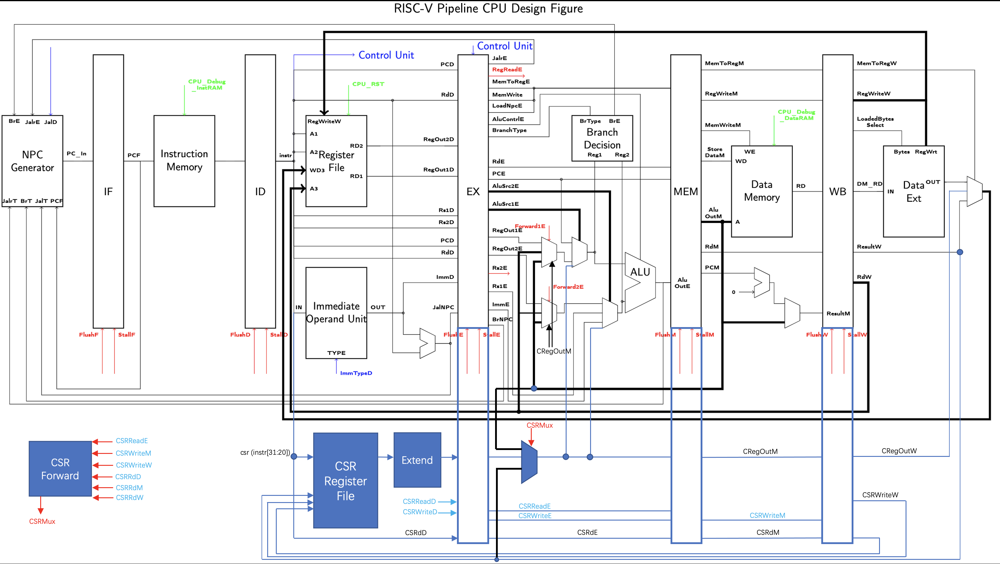

# 计算机体系结构 Lab 2实验报告

PB18030825 顾超 

## 实验目标

* 利用TA提供的RISC-V流水线CPU代码框架，填充相应位置的缺失代码，实现RV32I指令集中的功能。
* 实现CPU流水线中的数据转发与冒险检测
* 添加适当部件与数据通路，修改控制单元信号，使CPU支持CSR Access系列指令

## 实验环境

* VLAB 虚拟机(Ubuntu 20.04 LTS)
* Vivado 2019.1

## 实验内容及过程

### Phase 1

#### Control Unit

控制单元为本次实验CPU中最为复杂的部分。在本次实现中采用case语句，先判别OpCode字段，而后对该OpCode下统一信号进行赋值，最后再利用case语句块判断Funct3字段，从而最终决定控制信号输出内容，以下为其中一种OpCode的例子

```verilog
always @(*) begin
  case (Op)
    `OP_REG: begin
      // 通用
      RegWriteD <= `LW;
      ImmType <= `ITYPE;
      JalD <= 0;
      JalrD <= 0;
      MemToRegD <= `MTR_ALU;
      LoadNpcD <= 0;
      RegReadD <= 2'b11;
      BranchTypeD <= `NOBRANCH;
      AluSrc1D <= `SRC1_FD1;
      AluSrc2D <= `SRC2_FD2;
      MemWriteD <= 4'b0;
      CSRWriteD <= 1'b0;
      // Funct 特异
      case (Fn3)
        `F3_ADD: AluContrlD <= (Fn7 == 7'b0100000) ? `SUB : `ADD;
        `F3_SLL: AluContrlD <= `SLL;
        `F3_SLT: AluContrlD <= `SLT;
        `F3_SLTU: AluContrlD <= `SLTU;
        `F3_XOR: AluContrlD <= `XOR;
        `F3_SRLA: AluContrlD <= (Fn7 == 7'b0100000) ? `SRA : `SRL;
        `F3_OR:  AluContrlD <= `OR;
        `F3_AND: AluContrlD <= `AND;
        default: AluContrlD <= 0;
      endcase
    end
  // Other cases
  // ...
  endcase
end
```

#### ALU

ALU涉及到有符号数的运算与比较，故定义新的有符号wire并将输入信号与其直接相连，当涉及到有符号数操作时使用有符号wire进行处理。使用一case语句块，根据输入的AluControl信号决定对输入数据做何种运算，实现如下

```verilog
wire signed [31:0] SignedOperand1, SignedOperand2;
assign SignedOperand1 = Operand1;
assign SignedOperand2 = Operand2;

always @(*) begin
  case (AluContrl)
    `ADD: AluOut <= Operand1 + Operand2;
    `SUB: AluOut <= Operand1 - Operand2;
    `SLL: AluOut <= Operand1 << Operand2[4:0];
    `SRL: AluOut <= Operand1 >> Operand2[4:0];
    `SRA: AluOut <= SignedOperand1 >>> Operand2[4:0];
    `SLT: AluOut <= (SignedOperand1 < SignedOperand2) ? 1 : 0;
    `SLTU: AluOut <= (Operand1 < Operand2) ? 1 : 0;
    `XOR: AluOut <= Operand1 ^ Operand2;
    `OR: AluOut <= Operand1 | Operand2;
    `AND: AluOut <= Operand1 & Operand2;
    `LUI: AluOut <= Operand2;
    `LUI2: AluOut <= Operand1;
    `CLR: AluOut <= (~Operand1) & Operand2;
    `CLR2: AluOut <= Operand1 & (~Operand2);
    default: AluOut <= 0;
  endcase
end
```

#### BranchDecision

实现思路与ALU类似，仅涉及的操作类型不一样，具体实现如下

```verilog
wire signed [31:0] SignedOperand1, SignedOperand2;
assign SignedOperand1 = Operand1;
assign SignedOperand2 = Operand2;

always @(*) begin
  case (BranchTypeE)
    `NOBRANCH: BranchE <= 1'b0;
    `BEQ: BranchE <= (Operand1 == Operand2) ? 1'b1 : 1'b0;
    `BNE: BranchE <= (Operand1 != Operand2) ? 1'b1 : 1'b0;
    `BLT: BranchE <= (SignedOperand1 < SignedOperand2) ? 1'b1 : 1'b0;
    `BLTU: BranchE <= (Operand1 < Operand2) ? 1'b1 : 1'b0;
    `BGE: BranchE <= (SignedOperand1 >= SignedOperand2) ? 1'b1 : 1'b0;
    `BGEU: BranchE <= (Operand1 >= Operand2) ? 1'b1 : 1'b0;
    default: BranchE <= 1'b0;
  endcase
end
```

#### 访存与DataExt

由于本次CPU实现要求对非对齐访问指令做处理，故需对访存结果根据访存地址做一定偏移。又由于本设计框架无法实现在一个时钟周期内访问多个地址，也不提供处理该情况所需的状态机以及Stall信号，故不考虑跨越内存块的非对齐访问。由CPU的小端存储方式决定，高位在低地址，故当出现非对齐访问时只需将数据根据非对齐的情况进行一定位数的左移即可获得正确的数据，写入亦如此，具体实现如下

```verilog
// MODULE DATA EXT
always @(*) begin
case (RegWriteW)
    `NOREGWRITE: OUT <= 0;
    `LB: begin
        case (LoadedBytesSelect)
            2'b00: OUT <= { {25{IN[7]}}, IN[6:0] };
            2'b01: OUT <= { {25{IN[15]}}, IN[14:8] };
            2'b10: OUT <= { {25{IN[23]}}, IN[22:16] };
            2'b11: OUT <= { {25{IN[31]}}, IN[30:24] };
            default: OUT <= 0;
        endcase
    end 
    `LH: begin
        case (LoadedBytesSelect)
            2'b00: OUT <= { {17{IN[15]}}, IN[14:0] };
            2'b01: OUT <= { {17{IN[23]}}, IN[22:8] };
            2'b10: OUT <= { {17{IN[31]}}, IN[30:16] };
            2'b11: OUT <= 0;    // 跨越内存块，无法处理
            default: OUT <= 0;
        endcase
    end
    `LW: begin
        OUT <= IN;
    end
    `LBU: begin
        case (LoadedBytesSelect)
            2'b00: OUT <= { 24'b0, IN[7:0] };
            2'b01: OUT <= { 24'b0, IN[15:8] };
            2'b10: OUT <= { 24'b0, IN[23:16] };
            2'b11: OUT <= { 24'b0, IN[31:24] };
            default: OUT <= 0;
        endcase
    end
    `LHU: begin
        case (LoadedBytesSelect)
            2'b00: OUT <= { 16'b0, IN[15:0] };
            2'b01: OUT <= { 16'b0, IN[23:8] };
            2'b10: OUT <= { 16'b0, IN[31:16] };
            2'b11: OUT <= 0;    // 跨越内存块，无法处理
            default: OUT <= 0;
        endcase
    end
    default: OUT <= 0;
endcase
end
```

```verilog
// WB SEG REG
DataRam DataRamInst (
    .clk    ( clk                   ),
    .wea    ( WE << A[1:0]          ),
    .addra  ( A[31:2]               ),
    .dina   ( WD << (A[1:0] * 8)    ),
    .douta  ( RD_raw                ),
    .web    ( WE2                   ),
    .addrb  ( A2[31:2]              ),
    .dinb   ( WD2                   ),
    .doutb  ( RD2                   )
); 
```

#### 立即数处理

根据RISC-V指令立即数拓展规则，利用CU给出的指令类型输出对应的拓展后的立即数，实现如下

```verilog
always@(*)
begin
    case(Type)
        `ITYPE: Out <= { {21{In[31]}}, In[30:20] };
        `RTYPE: Out <= 32'b0;
        `STYPE: Out <= { {31{In[31]}}, In[30:25], In[11:7] };
        `BTYPE: Out <= { {20{In[31]}}, In[7], In[30:25], In[11:8], 1'b0 };
        `UTYPE: Out <= { In[31:12], 12'b0 };
        `JTYPE: Out <= { {12{In[31]}}, In[19:12], In[20], In[30:21], 1'b0 };
        `CTYPE: Out <= { 27'b0, In[19:15] };
        default:Out<=32'hxxxxxxxx;
    endcase
end
```

#### Next PC生成

根据Lab 1中得出的跳转指令优先级$(Branch=Jalr>Jal)$顺序，当对应信号为有效时将NPC输出置为对应地址，否则输出PC+4

```verilog
always @(*) begin
    if (BranchE != 0) begin
        PC_In <= BranchTarget;
    end
    else if (JalrE != 0) begin
        PC_In <= JalrTarget;
    end
    else if (JalD != 0) begin
        PC_In <= JalTarget;
    end
    else begin
        PC_In <= PCF + 4;
    end
end
```

### Phase 2

#### 数据转发

当出现以下情况时CPU会处理数据转发（同时考虑了CSR段的数据转发）：

* MEM阶段写信号有效、EX阶段读寄存器信号有效且EX读寄存器与MEM写寄存器一致
* WB阶段写信号有效、EX阶段读寄存器信号有效且EX读寄存器与WB写寄存器一致

* 涉及到CSR访问时，MEM、WB段CSR写信号有效且CSR写入地址与EX段CSR读出地址一致

```verilog
// Forward
always @(*) begin
    if(RegWriteM && (RdM != 0) && (RdM == Rs1E)) begin
        if (CSRWeM) begin
            Forward1E <= `FW1_CSR_MEM;
        end
        else begin
            Forward1E <= `FW1_ALU_MEM;
        end
    end
    else if(RegWriteW && RdW != 0 && RdW == Rs1E) begin
        Forward1E <= `FW1_REG_WB;
    end
    else begin
        Forward1E <= `FW1_REG_EX;
    end
        
    if(RegWriteM && (RdM != 0) && (RdM == Rs2E)) begin
        if (CSRWeM) begin
            Forward2E <= `FW2_CSR_MEM;
        end
        else begin
            Forward2E <= `FW2_ALU_MEM;
        end
    end
    else if(RegWriteW && RdW != 0 && RdW == Rs2E) begin
        Forward2E <= `FW2_REG_WB;
    end
    else begin
        Forward2E <= `FW2_REG_EX;
    end
        
end
```

#### 流水线停顿

当出现以下情况时流水线会停顿并Flush对应流水段

* CPU RST有效时，Flush所有段寄存器
* MEM阶段访存且访存写入地址与EX段读寄存器地址一致时，Flush EX段寄存器，并Stall IF、ID流水
* Branch及Jalr跳转时，Flush ID段寄存器
* Jal跳转时，Flush ID段寄存器

```verilog
// Stall
always @(*) begin
    if(CpuRst) begin
        {StallF, StallD, StallE, StallM, StallW} <= 5'b0;
        {FlushF, FlushD, FlushE, FlushM, FlushW} <= 5'b11111;
    end
    else if((RegReadE[0] && Rs1D == RdE && MemToRegE == 2'b01) || // 寄存器端口1 Hazard
        (RegReadE[1] && Rs2D == RdE && MemToRegE == 2'b01))   // 寄存器端口2 Hazard
        begin
            StallF <= 1;
            StallD <= 1;
            FlushE <= 1;
            {FlushF, FlushD, StallE, StallM, FlushM, StallW, FlushW} <= 8'b0;
        end
    else if(BranchE != `NOBRANCH || JalrE != 0) begin
        FlushE <= 1'b1;
        FlushD <= 1'b1;
        {FlushF, FlushM, FlushW} <= 3'b0;
        {StallE, StallF, StallD, StallW, StallM} <= 5'b0;
    end
    else if (JalD != 0) begin
        FlushD <= 1'b1; 
        {FlushF, FlushE, FlushM, FlushW} <= 3'b0;
        {StallE, StallF, StallD, StallW, StallM} <= 5'b0;
    end
    else begin
        {StallF, StallD, StallE, StallM, StallW} <= 5'b0;
        {FlushF, FlushD, FlushE, FlushM, FlushW} <= 5'b0;
    end
end 
```

### Phase 3

如Lab 1中设计图所示，添加如下数据通路，并在CU及ALU中添加对应功能以实现CSR指令要求。

* CU：添加识别OpCode=SYS的类型，同时根据Funct3决定ALU的指令
* ALU：添加按位置0操作，以及Operand1直接输出到AluOut的操作。

同时实现全路数据转发，具体数据通路如下图所示



对应数据转发以及新增数据通路添加的Mux实现如下

```verilog
assign ForwardData1 = Forward1E[1]?((Forward1E[0])?CSROutM:AluOutM):( Forward1E[0]?RegWriteData:RegOut1E );
assign Operand1 = AluSrc1E[1]?(CSRFwE):((AluSrc1E[0])?PCE:ForwardData1);
assign ForwardData2 = Forward2E[1]?((Forward2E[0])?CSROutM:AluOutM):( Forward2E[0]?RegWriteData:RegOut2E );
assign Operand2 = AluSrc2E[1]?((AluSrc2E[0])?CSRFwE:ImmE):((AluSrc2E[0])?Rs2E:ForwardData2 );
assign RegWriteData = MemToRegW[1] ? CSROutW : (MemToRegW[0] ? DM_RD_Ext : ResultW);
assign CSRFwE = (CSR_FW[1]) ? (ResultW) : ((CSR_FW[0]) ? (AluOutM) : (CSROutE));
```

CSR专用Forward模块如下

```verilog
always @(*) begin
    if(CSRWeM && CSRdE == CSRdM) begin
        CSRMux <= `CFW_MEM;
    end
    else if (CSRWeW && CSRdE == CSRdW) begin
        CSRMux <= `CFW_WB;
    end
    else begin
        CSRMux <= `CFW_REG;
    end
end
```

## 实验结果

经TA当面仿真检查，该CPU实现可以通过Lab 2中的3个testbench，同时针对CSR的6条指令以及CSR相关的寄存器数据相关转发均可以正常工作

## 实验总结

实验花费大约6-7小时，其中约一半时间用于Debug。

本次实验中遇到的问题主要如下：

* 未理清非对齐访问的问题

实验中遇到的坑：

* 处理非对齐访问时，对WD的偏移开始时采用了`WD << (A[1:0] << 3)`写法，发现传入数据始终为0，后改为`WD << (A[1:0] * 8)`后变为正常，原因未知。
* ALU进行算术右移时，以为只需采用了算术右移符`>>>`即可实现，后发现还需要将对应wire定义为`signed wire`类型才能正确工作。

