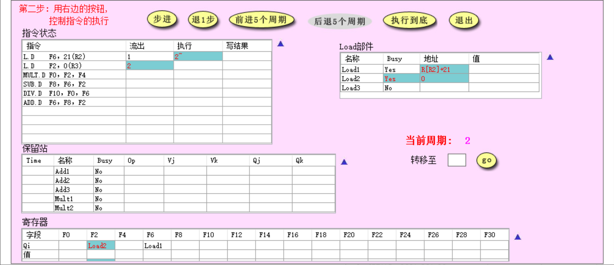
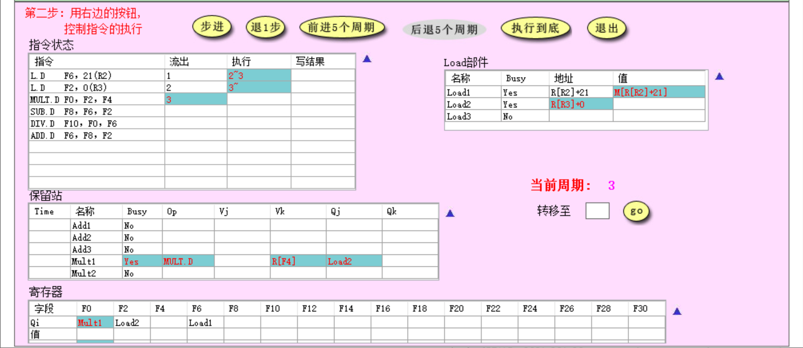
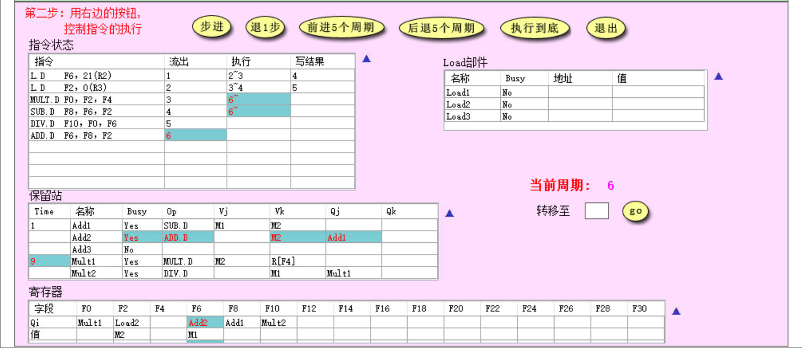
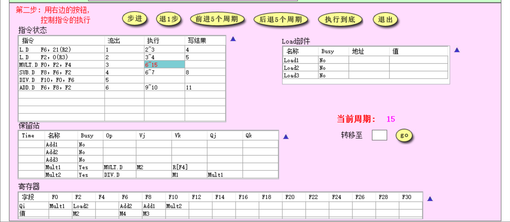
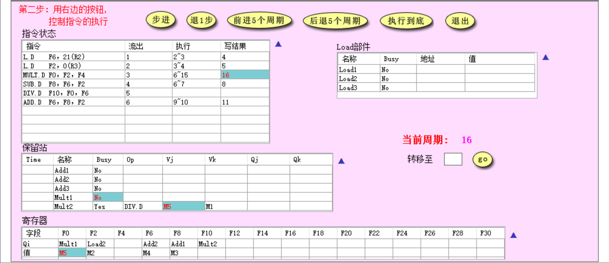
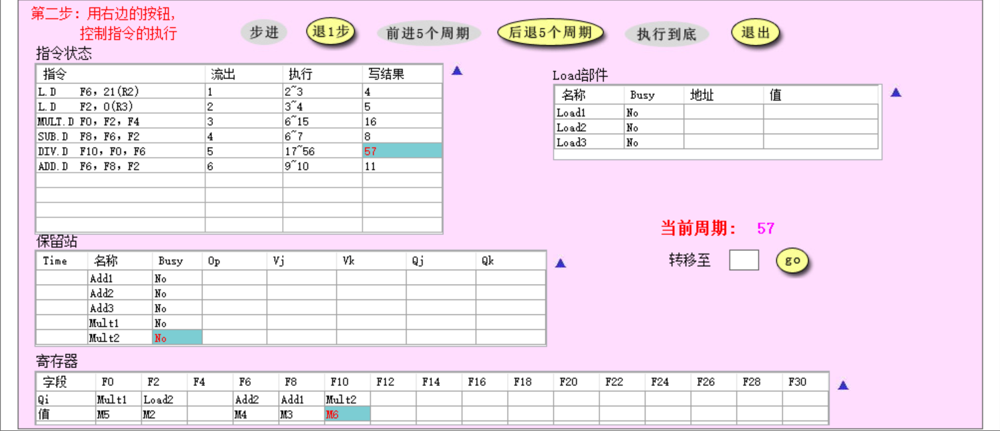
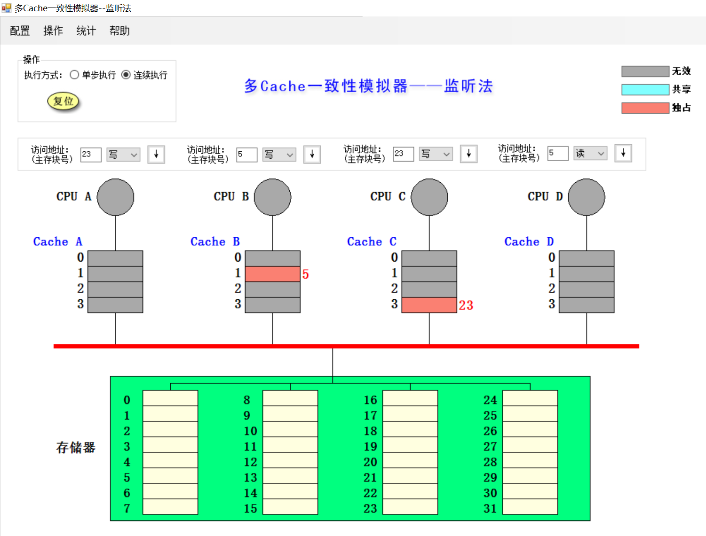
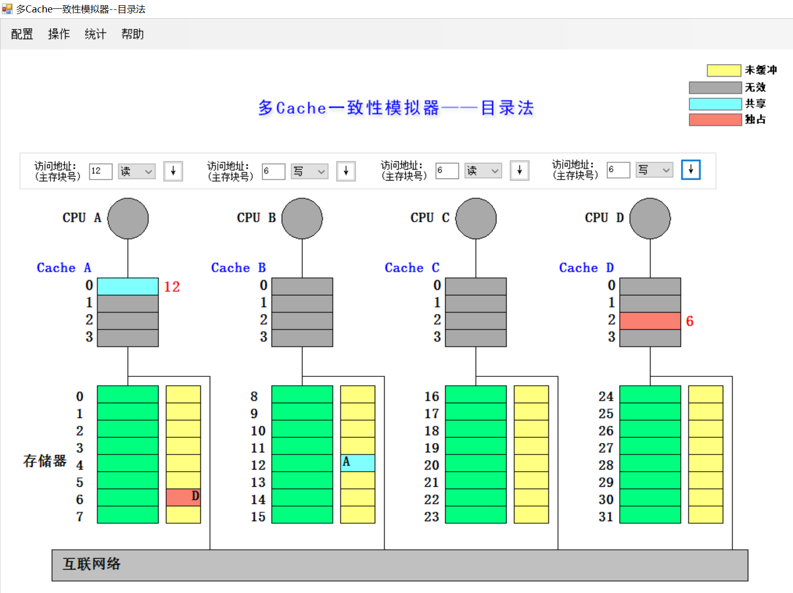

# 计算机体系结构 Lab 5 实验报告

顾超 PB18030825

## 实验过程

### Tomasulo

#### 1.

**周期2**时如图所示

**周期3**时如图所示

Load部件改动：

* Load1对应地址的值读取完成读出
* Load2完成地址计算

#### 2.

MUL.D开始执行为第6周期，截图如下所示

系统改动：

* 指令状态：MULT.D与SUB.D指令开始执行，ADD.D指令流出
* 保留站：ADD.D指令流入Add2功能部件并更新等待中的结果Add1与已知结果M2
* 保留站：Add1，Mult1功能部件开始执行，完成时间开始执行倒计时
* 寄存器：F6寄存器来源功能部件更新为Add2

#### 3.

F2寄存器上的RAW相关

#### 4.

**15周期**时状态如下图所示

**16周期**时状态如下图所示

* 指令状态：MULT.D指令完成写回操作
* 保留站：Mult1功能部件执行完成，变为空闲
* 保留站：Mult2功能部件操作数1结果就绪
* 寄存器：F0寄存器值更新为MULT.D指令执行结果

#### 5.

全部执行完成为第57周期，截图如下图所示

### Cache一致性（监听法）

| 所进行的访问   | 是否发生了替换？ | 是否发生了写回？ | 监听协议进行的操作与块状态改变                               |
| -------------- | ---------------- | ---------------- | ------------------------------------------------------------ |
| CPU A 读第5块  | F                | F                | Cache A Miss，存储器第5块写入到Cache A第1块，值传入CPU A     |
| CPU B 读第5块  | F                | F                | Cache B Miss，存储器第5块写入到Cache B第1块，值传入CPU B     |
| CPU C 读第5块  | F                | F                | Cache C Miss，存储器第5块写入到Cache C第1块，值传入CPU C     |
| CPU B 写第5块  | F                | F                | Cache B Hit，Cache B第1块变为独占块，同时Cache A、C的第一块变为无效块 |
| CPU D 读第5块  | F                | T                | Cache D Miss，Cache B第1块写回到存储器第5块，而后存储器第5块的值写入到Cache D第1块，Cache B、Cache D的第一块均变为共享块，并将值传入CPU D |
| CPU B 写第21块 | T                | F                | Cache B Miss，存储器第21块值写入到Cache B第1块，而后CPU B对Cache B第1块进行写数据，并变为独占块 |
| CPU A 写第23块 | F                | F                | Cache A Miss，存储器第23块值写入到Cache A第3块，而后CPU A对Cache A第3块进行写数据，并变为独占块 |
| CPU C 写第23块 | F                | T                | Cache C Miss，Cache A第3块写回到存储器第23块，而后存储器第23块的值写入到Cache C第3块，而后CPU C写入Cache C第3块，并将Cache A第3块变为无效块，Cache C第3块变为独占块 |
| CPU B 读第29块 | T                | T                | Cache B Miss，Cache B第1块写回到存储器第21块，存储器第29块值写入到Cache B第1块，并将值传入CPU B |
| CPU B 写第5块  | T                | F                | Cache B Miss，存储器第5块值写入到Cache B第1块，CPU B对Cache B第一块进行写操作，并将Cache B第一块变为独占块。 |

全部操作执行完后系统状态如图所示

### Cache一致性（目录法）

| 所进行的访问   | 监听协议进行的操作                                           | 块状态改变                                                   |
| -------------- | ------------------------------------------------------------ | ------------------------------------------------------------ |
| CPU A 读第6块  | Cache A Miss，存储器读出6号块数据写入到Cache A的2号块，而后数据传入CPU A | Cache A 2号块变为共享状态 6号存储器的目录变为A已缓冲      |
| CPU B 读第6块  | Cache B Miss，读请求由互联网络送往机器A的存储器，而后数据由互联网络传入机器B，写入到Cache B的2号块，而后数据传入CPU B | Cache B 2号块变为共享状态 6号存储器的目录变为A、B已缓冲  |
| CPU D 读第6块  | Cache D Miss，读请求由互联网络送往机器A的存储器，而后数据由互联网络传入机器D，写入到Cache D的2号块，而后数据传入CPU D | Cache D 2号块变为共享状态 6号存储器的目录变为A、B、D已缓冲 |
| CPU B 写第6块  | Cache B Hit，写请求发往机器A的存储器，机器A存储器通过内部线路及互联网络通知Cache A、D缓存失效，而后更改目录状态，随后CPU B对Cache B 2号块进行写操作 | Cache A、D 2号块变为无效状态 Cache B 2号块变为独占状态 6号存储器的目录变为B独占 |
| CPU C 读第6块  | Cache C Miss，读请求发往机器A，机器A向机器B发送取数据请求，Cache B的2号块数据传回机器A并写入到6号存储器，随后机器A通过互联网络将数据送往机器C，写入到Cache C 2号块，随后数据送往CPU C | Cache B、C 2号块变为共享状态 6号存储器目录变为B、C共享    |
| CPU D 写第20块 | Cache D Miss，写不命中请求发往机器C，机器C将数据送往Cache D，写入到Cache D 0号块中，随后CPU对Cache D 0号块进行写操作 | Cache D 0 号块变为独占状态 20号存储器目录变为D独占        |
| CPU A 写第20块 | Cache A Miss，写不命中请求发往机器C，机器C向机器D发送取并作废请求，机器D将数据传回机器C并写入到20号寄存器中，而后将数据送往Cache A，写入到Cache A 0号块中，随后CPU对Cache A 0号块进行写操作 | Cache D 0 号块变为无效状态 Cache A 0号块变为独占状态 20号存储器目录变为A独占 |
| CPU D 写第6块  | Cache D Miss，写不命中请求发往机器A，机器A向机器B、C发送作废请求，而后机器A将数据送往Cache D，写入到Cache D 2号块中，随后CPU对Cache D 2号块进行写操作 | Cache B、C 2 号块变为无效状态 Cache D 2号块变为独占状态 6号存储器目录变为D独占 |
| CPU A 读第12块 | Cache A Miss，机器A将写回并修改状态请求与数据发往机器C，机器C向20号存储器写入数据。而后机器A向机器B发送读不命中请求，机器B将12号存储器数据发送到机器A，写入到Cache A 0号块中，随后数据送往CPU A | Cache A 0号块变为共享状态 20号存储器目录变为未缓冲 12号寄存器目录变为A共享 |

全部操作执行完后系统状态如图所示

## 综合问答

### 1.

* 目录法：优点：适配分布式存储器；缺点：需要额外资源存储各个存储器的状态。
* 总线法：优点：数据传输快速，实现较简单；缺点：当通信数据量较大时，易导致总线带宽被大量占用，影响计算机性能。

### 2.

* Tomasulo算法与Score Board算法均解决了WAR、WAW、RAW冲突。
* Tomasulo是分布式算法，Score Board是集中式算法

### 3.

* 结构：检测到结构相关时暂停指令发射
* RAW：推迟指令执行
* WAR：用寄存器重命名避免
* WAW：用寄存器重命名避免